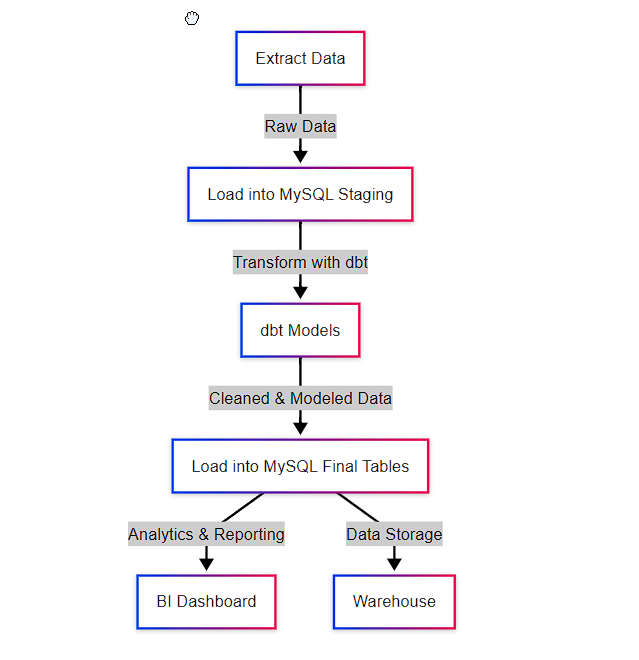

# ETL Pipeline with Airflow, dbt, and MySQL

## Overview

This project demonstrates how to build an **ETL (Extract, Transform, Load) pipeline** using **Apache Airflow**, **dbt (data build tool)**, and **MySQL**. The pipeline automates the extraction of raw data, transformation using dbt, and loading into a MySQL database for further analysis.

## Features

- **Automated Data Extraction**: Fetch data from CSV, APIs, or databases.
- **Data Transformation with dbt**: Clean, enrich, and model data for analytics.
- **Airflow Orchestration**: Schedule and monitor the pipeline execution.
- **MySQL Database Integration**: Store raw and processed data efficiently.
- **Docker Support**: Containerized deployment for scalability.

## ETL Pipeline Flowchart

Below is a flowchart representing the ETL pipeline:




## File Structure

```
etl_project/
│── airflow/                # Airflow-related files
│   │── dags/               # DAGs directory
│   │   ├── etl_pipeline.py # Airflow DAG for ETL
│   │── config/             # Airflow configuration
│   │   ├── airflow.cfg     # Airflow config file
│   │── logs/               # Airflow logs
│   │── plugins/            # Custom plugins if needed
│── dbt_project/            # dbt project files
│   │── models/             # SQL models
│   │   ├── raw/            # Raw tables (staging)
│   │   ├── transformed/    # Transformed tables
│   │   ├── final/          # Final models for reporting
│   │   ├── transform.sql   # Sample transformation SQL
│   │── seeds/              # Static data for dbt
│   │── tests/              # dbt tests
│   │── dbt_project.yml     # dbt project configuration
│   │── profiles.yml        # dbt MySQL connection settings
│── scripts/                # Python scripts for ETL
│   │── extract.py          # Extract data from source
│   │── load.py             # Load data into MySQL
│   │── transform.py        # Transformation logic
│── data/                   # Raw data storage
│   │── input/              # Input CSVs or JSONs
│   │── output/             # Processed data
│── docker/                 # Docker-related files (if using)
│   │── Dockerfile          # Airflow & dbt setup
│   │── docker-compose.yml  # Multi-container setup
│── config/                 # Configuration files for MySQL, dbt, etc.
│   ├── db_config.json      # MySQL credentials
│   ├── airflow_env.env     # Airflow environment variables
│── logs/                   # Log files for debugging
│── README.md               # Project documentation
```

## Installation

### **Prerequisites**

- Python 3.11.4

- MySQL installed and running

- Apache Airflow installed

- dbt-mysql installed

- Docker (optional)

### **Setup Instructions**

1. Clone the repository:
   ```bash
   git clone https://github.com/your-username/etl_project.git
   cd etl_project
   ```
2. Install dependencies:
   ```bash
   pip install -r requirements.txt
   ```
3. Configure MySQL connection in `config/db_config.json`:
   ```json
   {
     "host": "localhost",
     "user": "root",
     "password": "your_password",
     "database": "etl_db"
   }
   ```
4. Initialize Airflow:
   ```bash
   airflow db init
   airflow webserver --port 8080 &
   airflow scheduler &
   ```
5. Set up dbt:
   ```bash
   dbt init dbt_project
   cd dbt_project
   dbt run
   ```
6. Run the ETL pipeline:
   ```bash
   airflow dags trigger etl_pipeline
   ```

## Usage

- Monitor the pipeline in the Airflow UI (`http://localhost:8080`).
- Check transformed data in MySQL:
  ```sql
  SELECT * FROM transformed_table;
  ```
- Modify `dbt_project/models/transform.sql` to adjust transformations.

## Contributing

1. Fork the repository
2. Create a feature branch (`git checkout -b feature-name`)
3. Commit your changes (`git commit -m "Add feature"`)
4. Push to the branch (`git push origin feature-name`)
5. Open a Pull Request

## License

This project is licensed under the MIT License.
